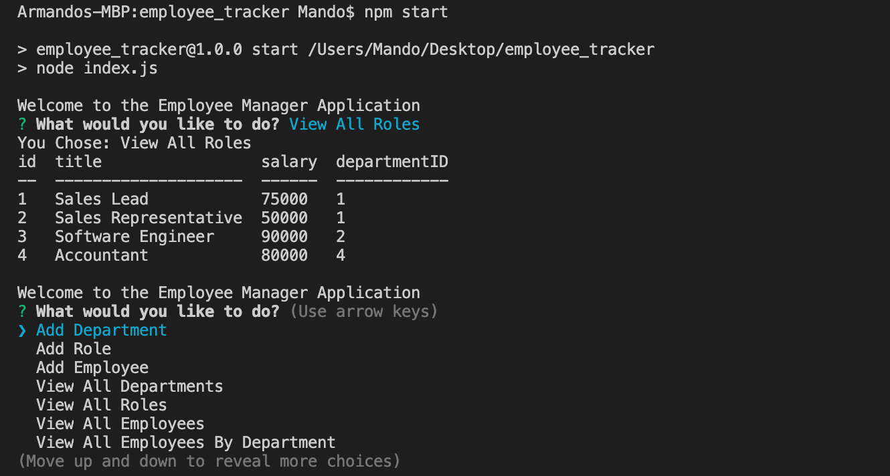

# employee_tracker

## Description
In this node.js based application, the user will be able to keep track of their employees by submitting and searching data that will be stored and handled with mySQL.

## Table of Contents
* [Title](#Title)
* [Description](#Description)
* [Installation](#Installation)
* [Usage](#Usage)

## Installation
Clone Repository.

For this application you will need MySQL workbench and node.js. It is a node.js application so an npm install is required, as well as an npm install inquirer, npm install my sql, and an npm install console.table. User will need to input the schema.sql file into there workbench and execute the code to have a functional server. User will enter there password that will connect them to their server. Once these tools are installed, the application should be functional.

## Usage
In the terminal through the correct directory of the folder, run 'npm start' and the app will start immediately.

